# Making a volumetric fog cube（体积雾立方体 · Part 1）

> [!info] 说明
> 本文译自 MinionsArt 的 Patreon 教程 *Making a volumetric fog cube (Local Clouds Volume part 1)*，译文为简体中文，代码／节点截图保留原文。
> 这是 [Rolling Local Clouds Volume（滚动局部体积云）](Rolling%20Local%20Clouds%20Volume（滚动局部体积云）.md) 的**前置文章**。
> 原文附带的实际文件名为：`FogVolume.shader`、`VolumeBox.hlsl`、`VolumeFog.shadergraph`（正文中提到的 `VolumeDepthFog.shader` 即指代码版）。

大家好，

我原本想用一篇文章就把「体积云海／滚动雾」效果讲完，但后来觉得还是先写一篇 **Part 1／基础篇**——讲如何用 **Ray-Box intersection（射线与盒子求交）** 做一个体积立方体——这样文章不至于太长，而且这个基础还能用到其它效果上。当然，这篇的成果本身也是独立可用的。
因为在用 raymarching 步进、做出局部体积滚动云之前，我们得先有那个**局部体积**。

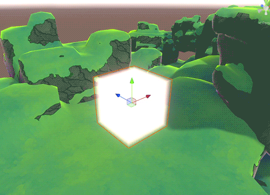

所以这一篇里，我们要做一个**深度雾体积**：只有单一颜色，外加一个密度滑条。

> [!note] 原文此处嵌有一段演示视频（Patreon 站内视频，无独立下载链接，故未包含在译文中）

这个基础深度雾版本在**门口／区域过渡**或者**死亡陷阱**这类场景里很有用——相机可能会跟着玩家稍微进到里面去。而我几年前分享过的那种简单雾面片，在进入时就会消失或者被裁掉。

我用代码来讲解，因为任何 Shader Graph 版本基本都会是一堆自定义节点加代码，最后我也会附上 Shader Graph 的成品以及用于自定义节点的 `.hlsl` 文件。

先讲点理论基础！

# Ray Box Intersection（射线与盒子求交）

因为我们要做一个**可摆放的局部体积**，所以需要知道如何在不依赖网格（mesh）的前提下求出一个立方体的形状——网格本身并不能提供体积信息。

我们的做法是套用一个已知公式：**ray box intersection（射线盒求交）**，以及一种叫 **"Slab"（平板法）** 的方法。

我们要用数学来判断一条射线（从相机发出）是否击中一个盒子。

下面用 2D 来说明，因为更好解释。

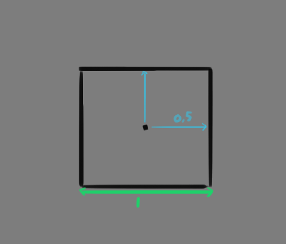

我们想击中的盒子位于 (0, 0) 位置。
它的宽度是 1 个单位，所以要求出两侧边界，就是在 x、y 轴上减 0.5 或加 0.5。

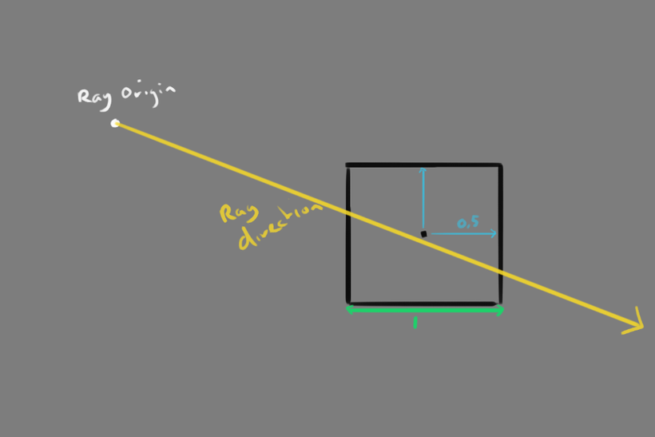

接着我们有一个射线起点（比如相机位置），以及从该点出发的方向。
我们知道射线起点的 Vector2 位置，也知道方向的 Vector2。具体数值不重要，看图即可。

这些信息已经足够求出射线进入和离开盒子的两个交点位置了。

## Slabs（平板）

我们会把盒子每个轴上的墙壁向两侧无限延伸，形成一个个「平板（slab）」来做相交判断。
这些 Slab 是由「到前墙的距离」和「到后墙的距离」这两个轴构成的。
这些墙分别在 -0.5 和 +0.5 处，也就是两个轴上 -0.5 到 +0.5 之间的无限延伸的平面。

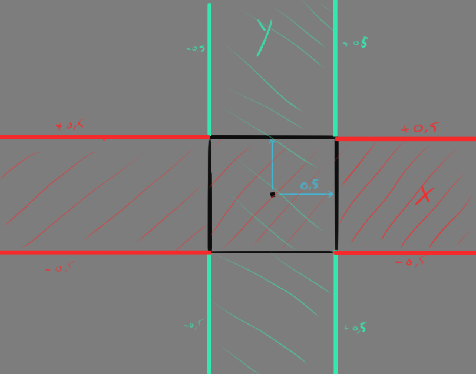

射线会与这些 slab 相交、得到交点。

如果我们先在 X 轴和 Y 轴上处理**最近的／前方的墙**，首先会命中这 2 个交点：一个对应 X，一个对应 Y。

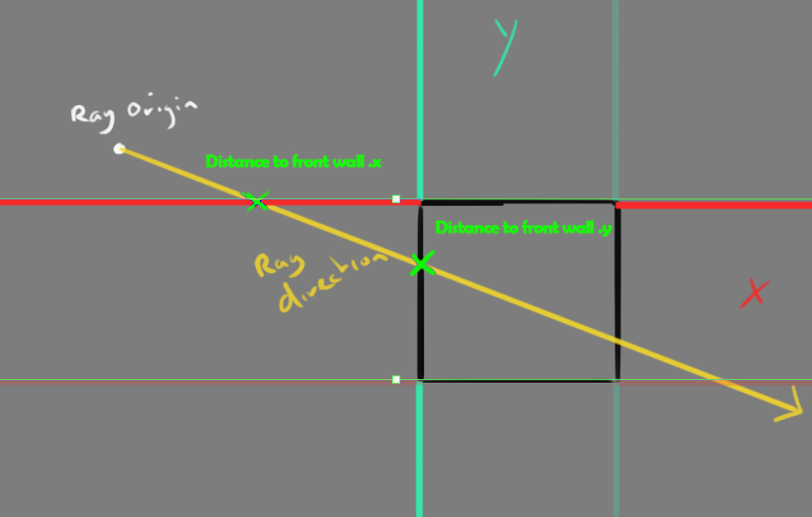

然后对**后方（最远的）墙**再做一次同样的操作。

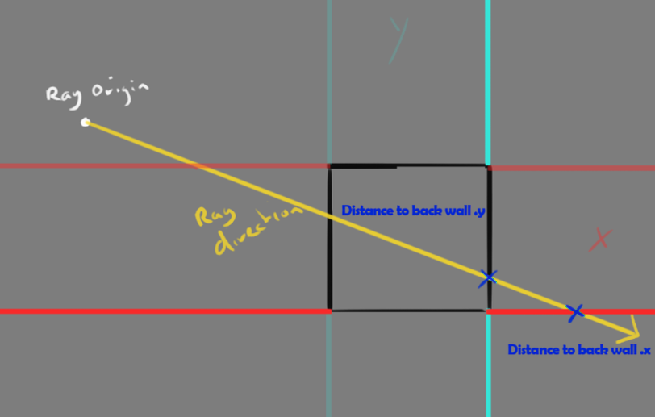

这样我们就得到了到前墙和后墙的距离点。

这等价于用射线起点沿射线方向做 ±0.5 的偏移后相减；因为起点的值已知，我们也就能求出从起点到这些交点的距离。

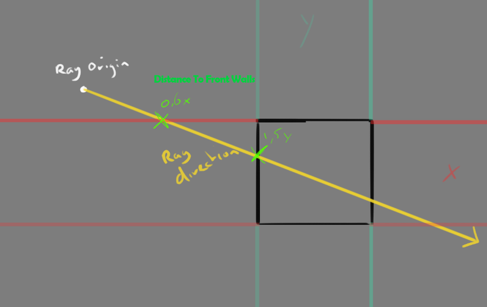

对于前墙，取**最远的／最晚的那个交点**胜出，也就是最靠近盒子中心（1, 5）的那个值。

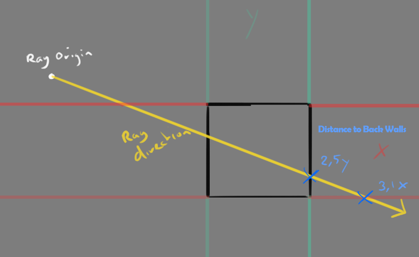

对于后墙，取**距离最小的／最早的那个交点**胜出（2, 5），它更靠近盒子中心。

由此我们就能判断射线是否位于盒子内部。

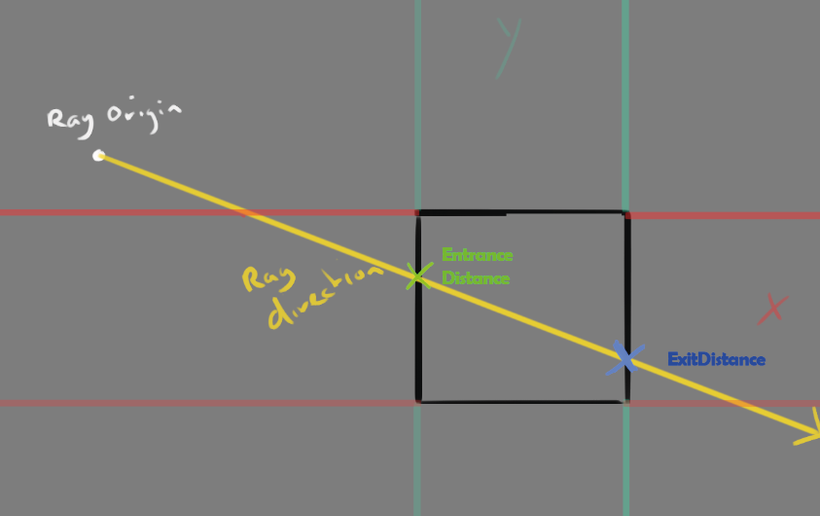

如果射线进入的距离小于离开的距离，那么它一定在盒子内部。

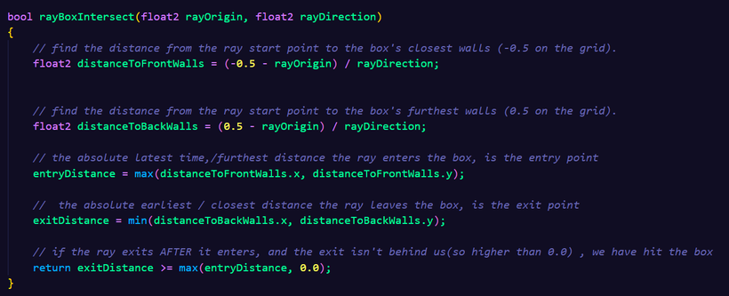

下面是这段逻辑的代码，配合注释应该不言自明。

### 如果没击中呢？（What about a miss?）

到目前为止的例子都在展示**命中**的情况，但如果是**未命中**，看起来会是这样：

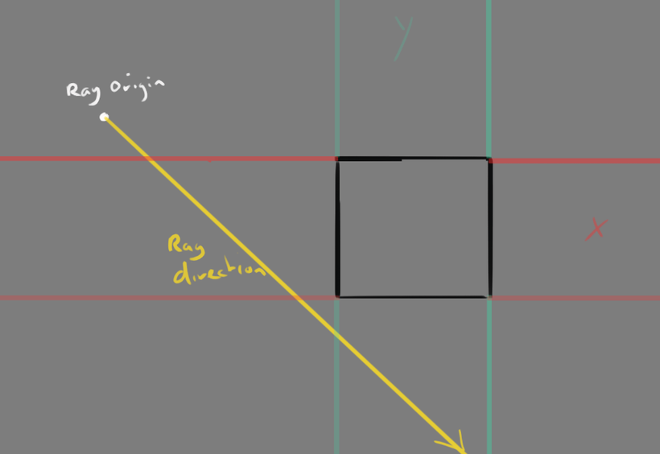

从起点发出的一个新方向。

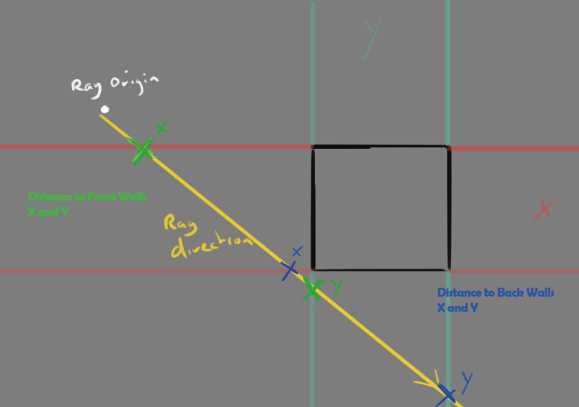

这里能看到未命中时绿色的「前墙距离」和蓝色的「后墙距离」。
如果我们按距离比较谁胜出：绿色的 Y 因为最远而胜出，蓝色的 X 因为最近而胜出。

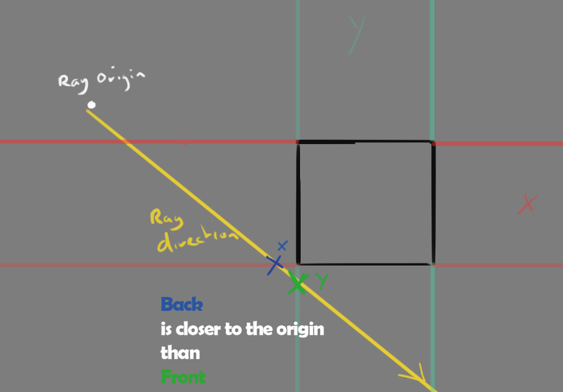

但这时，后墙的胜出值比前墙的胜出值更靠近起点——这就意味着射线没有击中盒子。**离开距离小于进入距离**，这在命中情况下是不成立的。

rlhugh 的这个 YouTube Short：

https://www.youtube.com/shorts/GqwUHXvQ7oA

用动画演示了这套理论，如果还没理解的话，看这个也许能一下想通。

现在我们不仅知道射线有没有击中盒子，还知道从起点到盒子两个交点的**进入距离和离开距离**。

### 把距离变成渐变（Getting the distances as a gradient）

有了进入和离开距离，我们就可以做一个渐变，让效果更柔和。

用**离开距离减去进入距离**，就能得到一个基于「在盒子内部穿行距离」的值。

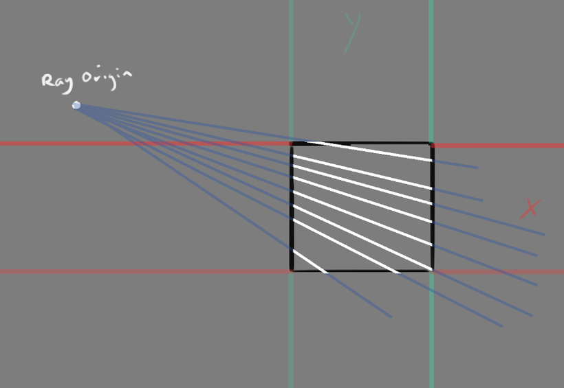

想象一下：从同一个起点发出的许多射线击中盒子的不同位置。
如果只看那些真正击中盒子内部的射线，你会发现它们的长度**并不相同**。

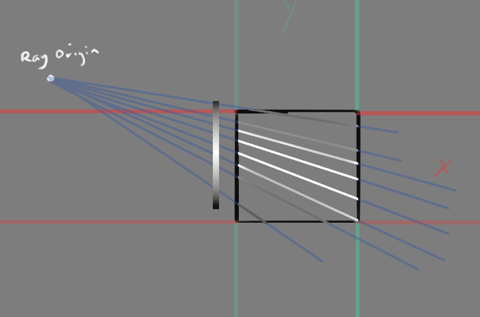

如果把「离开点与进入点之间的距离」转换成 0 到 1 的值，那么从射线起点／相机的视角看上去，就能得到一个柔和的渐变效果。

### 从 2D 到 3D 的逻辑（2D to 3D logic）

现在回到我们的 shader——这里没有 2D 盒子，而是 3D 盒子。
实际上变化不大：求交函数的返回结果依然是命中或未命中，同时也通过输出参数（`out float ...distance`）给出进入和离开距离。用于起点、方向和墙面判断的 float2 现在都变成了 3 个轴。

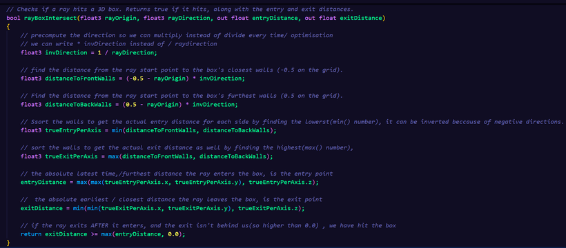

相比前面的 2D 代码示例，这里多了一处处理：针对**负方向的射线**做额外判断，确定哪个才是真正的最近墙／最远墙（`trueEntryPerAxis` 和 `trueExitPerAxis`）。
如果射线方向是从另一侧过来的，前后墙可能会反过来，因为我们要用的只是任意的 -0.5 和 0.5 这两个值。

### 做一个柔和的立方体（Making a soft cube）

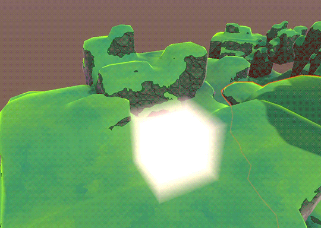

现在可以开始做一个柔和的立方体了。

这个 shader 的设置为：**Unlit、Transparent、Blend One OneMinusSrcAlpha（Premultiply）、ZWrite Off**。

最基础的版本会逐像素输出「在盒子内部的距离」。

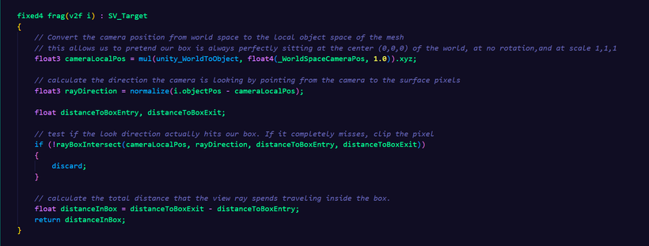

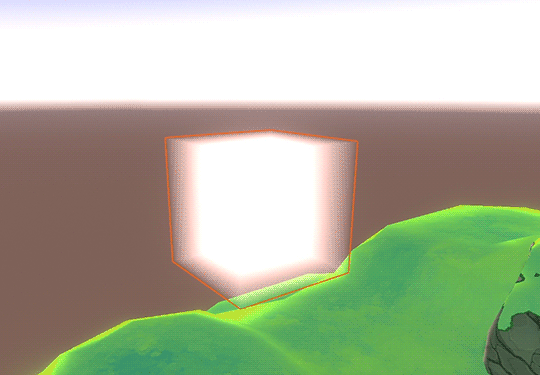

射线盒求交意味着结果**永远是一个盒子**，即使你换成别的网格也一样。

### 解决相机／地面裁切问题（Solving Camera/floor clipping）

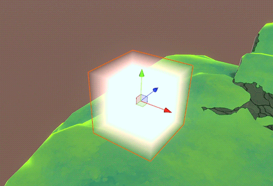

把相机放进盒子内部，它就消失了。

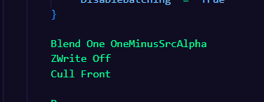

我们可以用 **Cull Front** 来解决。

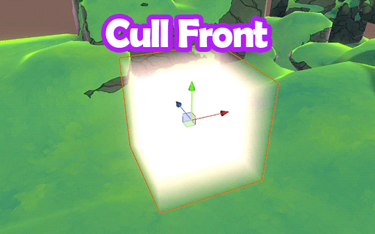

用了 Cull Front 之后，我们只渲染背面，所以相机进到里面也不会出问题。
但现在如果盒子与地面相交，它会**穿透地面**。

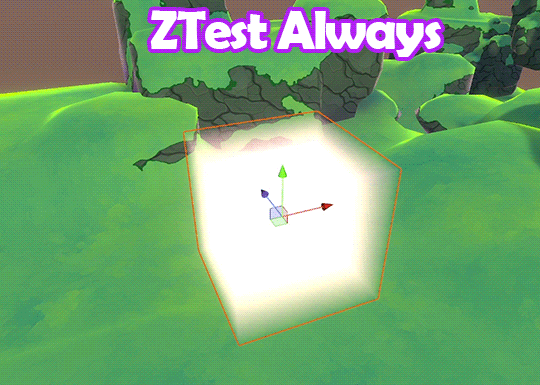

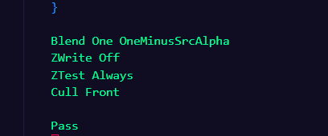

于是再加一个 **ZTest Always**，这样 shader 总会绘制我们的立方体。
但这样一来它又不理会前方是否有遮挡了——它会永远可见，即使隔着地板和墙壁也能看到。

### 深度检测（Depth Checking）

最终的解决方案是使用**深度缓冲（depth buffer）**。

因为这是一个体积，我们不能简单地用标准深度测试，而是要把射线自身的距离也考虑进去。

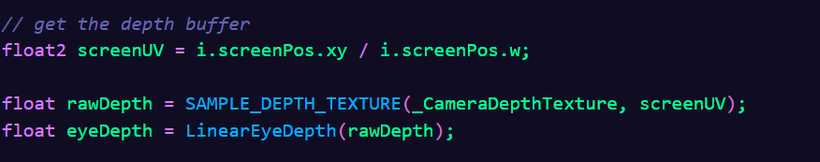

首先需要深度纹理。
这里用 `eyeDepth`，因为我们需要的是世界单位，而不是 0–1 的 `linearDepth`。

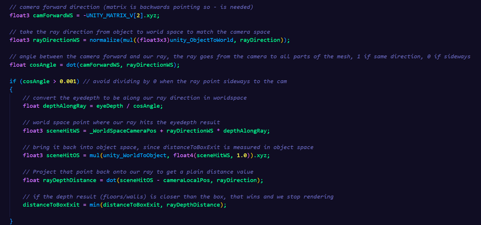

深度缓冲给出的，是当前像素在**正前方**（dead-on）方向上距相机的世界空间距离。
但我们其实是朝网格表面发射了**一堆**射线，并不都是正前方的，所以需要做一串转换：

> 世界空间下到相机的距离 → 按射线方向做角度校正 → 射线的世界空间命中点 → 射线的物体空间命中点 → 射线距离

这样我们就能把它和 `distanceToBoxExit` 作比较，谁更近就用谁——深度，或者盒子出口。

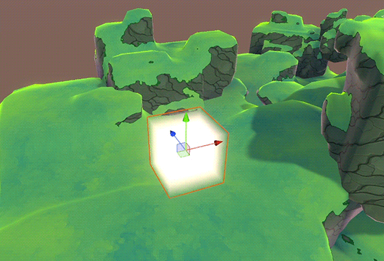

现在它会自然地融进地面和墙壁里了。

### 密度与颜色（Density and Color）

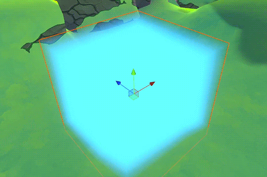

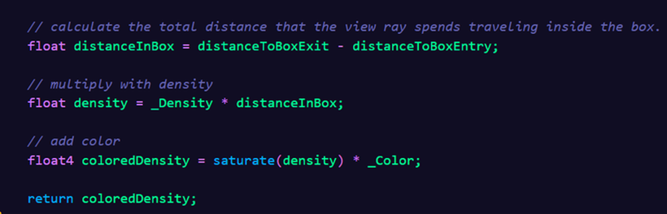

现在把 `distanceInBox` 乘上 `_Density`（float），再乘上 `_Color`，就得到了本篇的最终结果。

在后续文章中，我们会用这个体积盒，通过在立方体内部的距离上**逐层步进（marching through slices）**来采样纹理，从而做出云的效果。

## Shader Graph URP 版本

这里是 Shader Graph 版本：

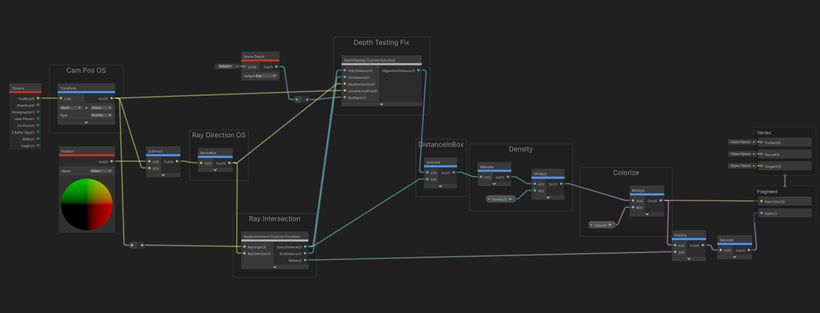

自定义节点同样有一个 hlsl 文件，里面的代码和前面展示的一致，只是为 Shader Graph 做了适配。

## 文件（Files）

附件包括：

- **VolumeDepthFog.shader** — BIRP / URP 代码版本（在未来的 URP 版本中可能不再适用）
- Shader Graph 文件 + 用于 Custom Function 的 `.hlsl` 文件
  > [!warning] 注意
  > 你需要手动把 hlsl 文件指定给 Custom Function 节点！

参考资料：

- *Real-Time Rendering* (1999)，作者 Tomas Möller 与 Eric Haines

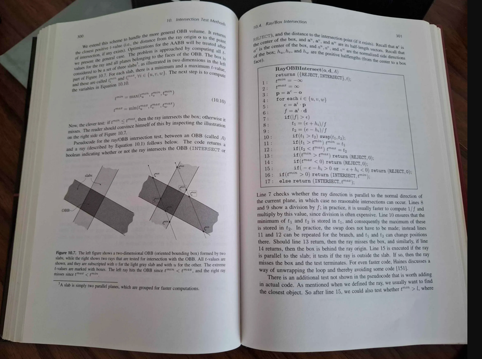

- https://tavianator.com/2022/ray_box_boundary.html

---

> [!tip] 系列导航
> **Part 1（本篇）**：体积雾立方体 —— Ray-Box 求交、深度检测、密度与颜色
> **Part 2**：[Rolling Local Clouds Volume（滚动局部体积云）](Rolling%20Local%20Clouds%20Volume（滚动局部体积云）.md) —— 纹理采样、raymarching 切片、垂直渐变、上色
