# Rolling Local Clouds Volume（滚动局部体积云）

> [!info] 说明
> 本文译自 MinionsArt 的 Patreon 教程 *Rolling Local Clouds Volume*，译文为简体中文，代码／节点截图保留原文。
> 原文附带文件：`RollingCloudsVolume.shader`（BIRP/URP 代码版）、`VolumeClouds.hlsl`、`RollingCloudsVolume.shadergraph`。

大家好，

这篇文章里，我们要做一个简单的**风格化滚动云**效果。
灵感来自于我玩《异度神剑 2》（Xenoblade 2）——里面那片可以在其中游泳的「云海」实在太酷了。

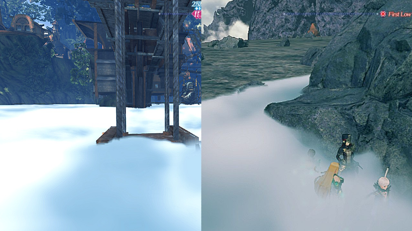

这个效果适用于在地面上低空流动的云雾，而不是那种可以从任意角度观看的云——不过跟着做完这篇之后，想要扩展成后者也差不太远。
另外它是纯风格化的，没有复杂的阴影和光照计算，所以应该比较好上手。

## 准备工作（Getting started）

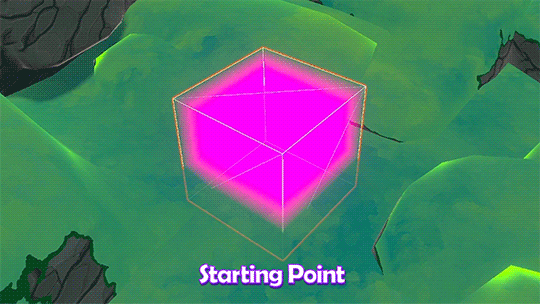

本文是 [Making a volumetric fog cube（体积雾立方体 Part 1）](Making%20a%20volumetric%20fog%20cube（体积雾立方体%20Part%201）.md) 的延续，会从那篇的最终结果开始。接着我们做一些熟悉的纹理采样，然后进入 raymarching（光线步进），最后用 lerp 混合颜色。

# 纹理采样（Texture Sampling）

现在我们有了这个小体积，接下来要做的就是在其中以**世界空间**采样一张纹理。

## 基础世界空间采样（Basic Worldspace）

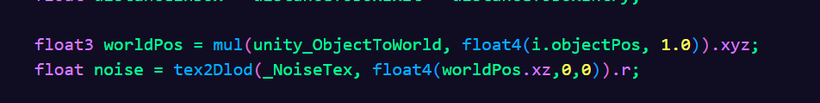

先试试最标准的方式：把物体空间转换到世界空间来采样纹理。这里一开始就用 `tex2Dlod`，因为后面的 raymarching 循环会需要它。

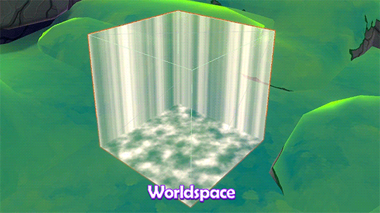

基础的世界空间采样能跑通，但结果看起来不对。因为它只是在用立方体的**背面**（我们仍然保持着 **Cull Front**），完全没有体积感；而且由于 **ZTest Always**，它会覆盖在所有东西之上。

## 换用不同的采样点（Using Different Sample Points）

那么，如果我们不用物体位置，而是用进入点／离开点来采样，会发生什么？

## 进入点（Entry Point）

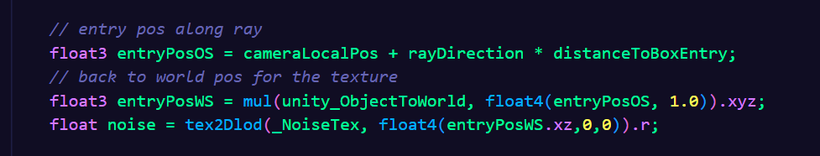

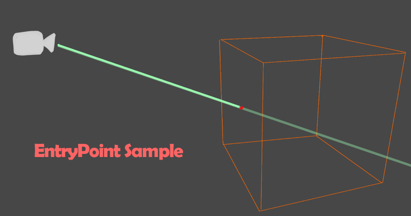

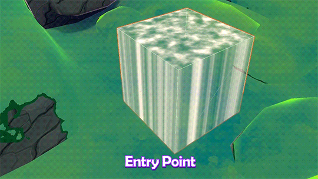

如果从进入点采样，看起来就像能看到正面——因为我们是从正面的位置采样。它用背面的几何渲染出了正面的样子，并依靠采样点把位置纠正了过来。

## 离开点（Exit Point）

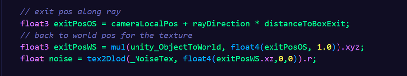

再试试另一侧，用离开点采样会是什么样？

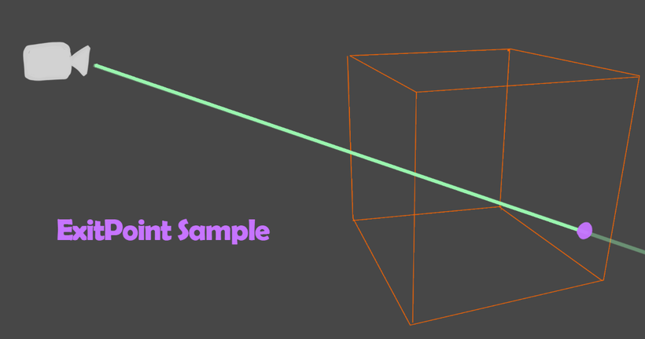

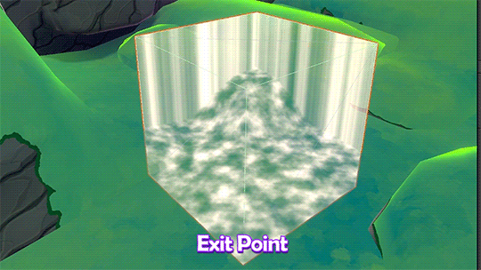

和第一个世界空间的 GIF 类似，因为我们看到的仍是背面；不过这次把深度也考虑进来了，因为 `distanceToBoxExit` 会在这里停下。

# Raymarching（光线步进）

这里有个问题：体积雾立方体所用的那两个值（进入点／离开点）对纹理采样来说并不好用。如果我们能拿到盒子**内部**的位置，而不是只拿到表面上的位置，那就理想多了。
这正是我们需要 raymarching 的原因。
我们可以沿着体积内部的距离一步步前进，这样就能**一层一层（slice by slice）**地处理。

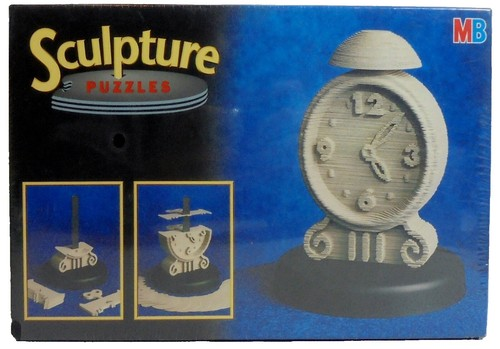

如果你玩过那种老式的 3D 雕塑拼图（3D Sculpture puzzle），它能帮你直观理解这里发生的事情（这个例子可能有点小众，我找到了一个制作过程的视频，以防你没见过）。

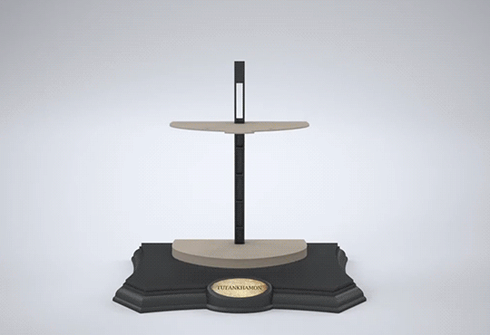

这种拼图是用一层层切片来还原一个 3D 纹理，这跟 raymarching 的切片思路很像。

## 切片（Slices）

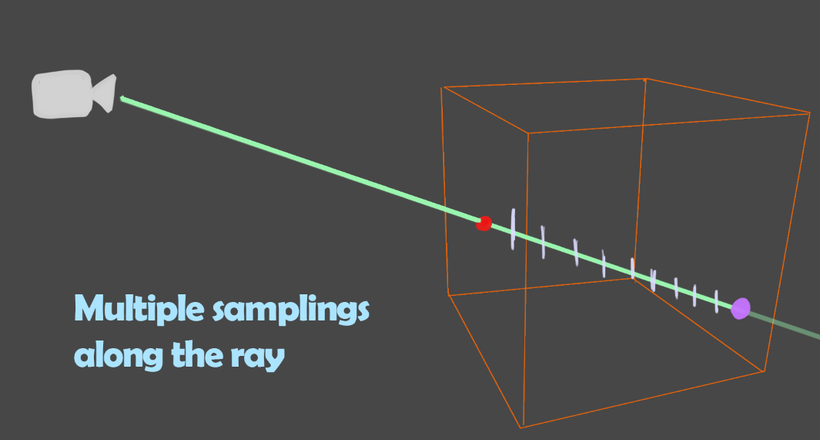

我们的做法是：在体积内部沿着光线用循环切出很多层，用 `_StepCount` 控制层数、用 stepSize 控制每步的距离。

stepSize 就是循环里从进入点往离开点方向每次前进的距离。

这些图只是在可视化**一条**光线，但我们的立方体会为屏幕上的**每个像素**都沿各自方向取切片，所以实际情况比这要复杂一些。

## 循环（Looping）

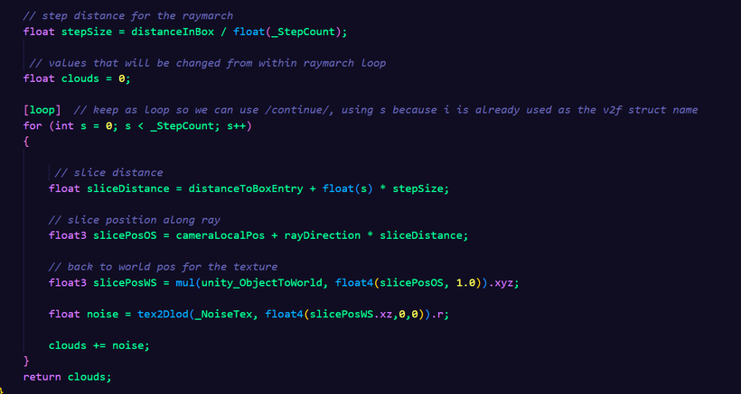

这是我们要先尝试的循环。

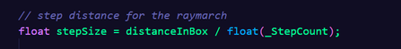

材质里有一个参数 `_Stepcount`，用来设置步数／切片数。
为了求出每次要往前推进多远，我们算出 stepSize：它等于盒子内部的距离除以步数。此时还没有考虑光线方向，那部分会在循环里处理。

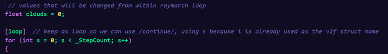

接着我们声明一个 clouds 值，用来在循环里累加每一层采到的噪声，然后建立循环。

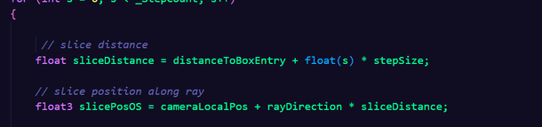

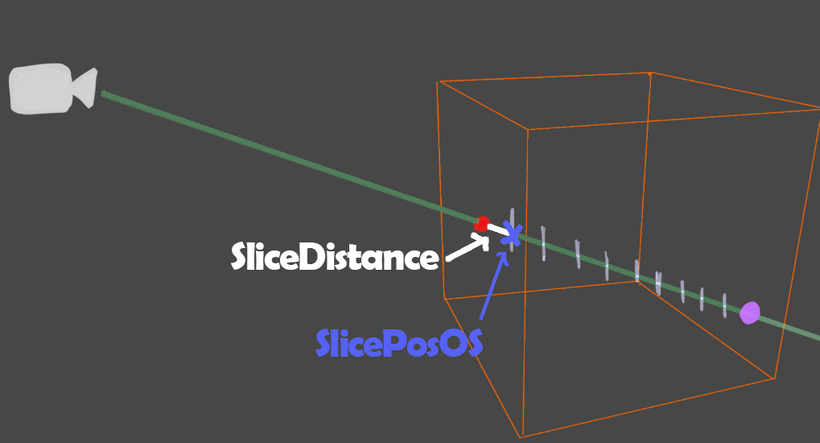

从盒子起点开始，一步步走到内部每个位置，每次都算出一个新的切片位置用于采样。

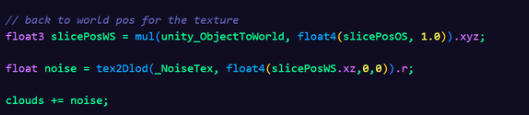

然后把它转成世界空间坐标，用于纹理采样。

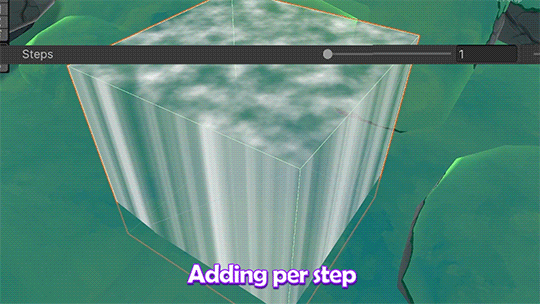

现在看起来有体积感了，但每多加一步就会更亮——因为我们只是把所有东西简单相加，没有考虑每一层实际「贡献」了多少。

我们需要让每一层新增的量，随着「已经被挡住的部分」而减少。

可以使用下面这套做法：

```
Visibility = 1                              // 穿过所有切片后的总可见度

循环内：
    首先：
    Passthrough = exp(-density * stepSize)  // 本层密度 × 步长；exp(-x) 把密度映射为取反后的 0–1 范围
    然后：
    Visibility *= Passthrough
```

你可以把这理解为：透过体积看过去，就像透过一堆涂了颜料的玻璃板。如果第一块玻璃上的颜料完全不透明，那后面的层就不重要了，因为视线已经被挡住了。

在 shader 里我们用 0 到 1 的数值来表示，而不是真实的透明玻璃＋颜料，但道理是一样的。

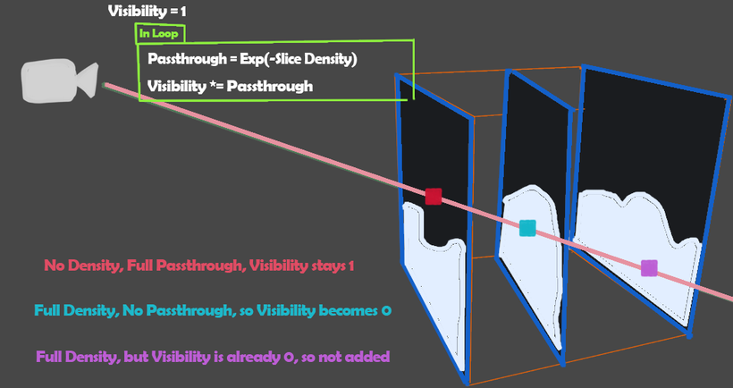

只要有密度挡住视线，每一层的可见度就会下降。

我们换一组数值再看一次：

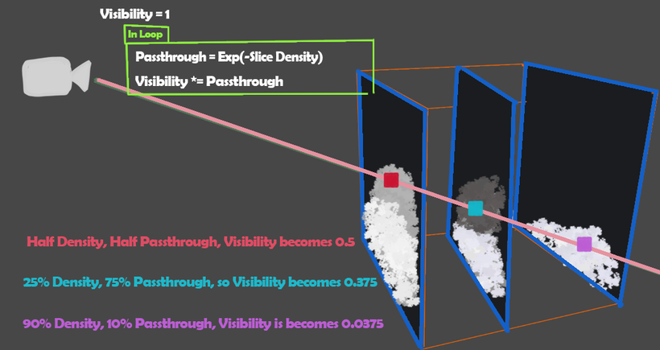

所以我们需要在循环过程中，用每一层来追踪这个 visibility。

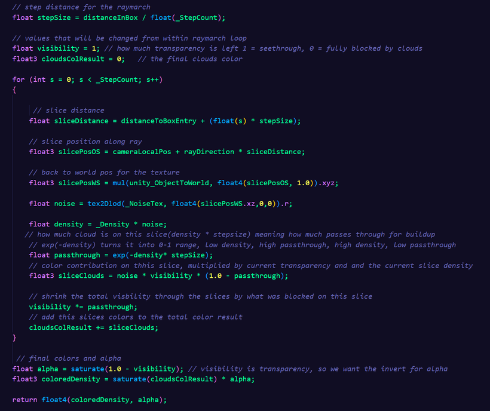

这是循环的下一版，我们来看看。

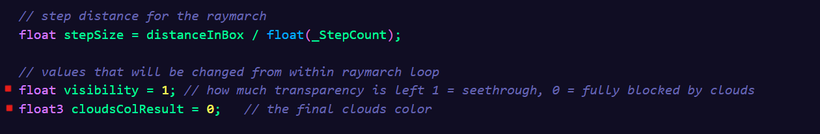

首先把 visibility 这个 float 设为 1，表示完全可见。
然后可以把累加的 clouds 由 float 改成 `float3 cloudsColResult`——最终我们想要彩色的云，所以现在就改成 float3 比较好。

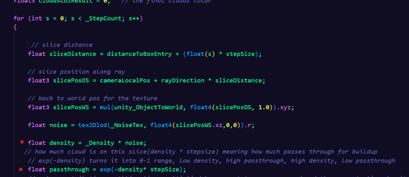

接着在循环里，把滑条参数 `_Density` 和噪声相乘，并用它计算这一层的 passthrough。

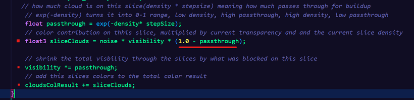

在把当前层的噪声累加到 cloudsColResult 之前，先乘上 visibility，以及 0–1 空间下该层的密度（即 `1 - passthrough`）。
同时更新 visibility，供下一层使用。

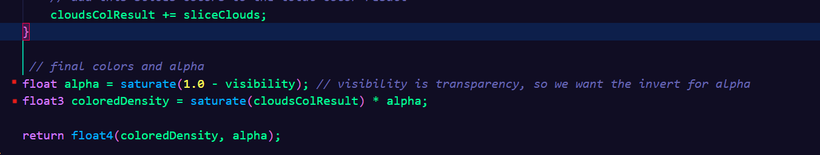

然后用 1 减去 visibility 得到 alpha（visibility 是「穿透后的可见度」，取反就是「被挡住的部分」）。
再把 alpha 与 cloudsColResult 相乘，得到最终颜色。

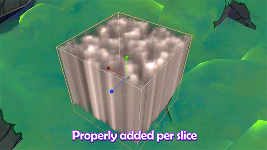

现在噪声的叠加正常了，不会让整张画面过曝；而且因为它是 float3，颜色信息也在，所以能看到灰阶，而不是单纯用 alpha。

# 垂直渐变（Vertical Fade）

我们加一个垂直方向的渐变，这样云的形状会更容易看清。

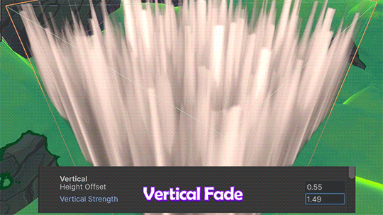

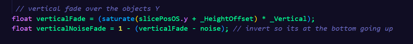

我们取切片位置的 Y（`slicePosOS.y`），加上 `_HeightOffset`，再乘以 `_Vertical`，这样可以移动渐变的起始位置并缩放强度。
然后减去噪声并取反——因为渐变默认是从上往下，而我们需要从下往上。

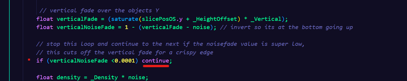

对于渐变以上的像素，我们可以利用循环：当垂直渐变值过低时直接 `continue` 跳过。这样能得到干净利落的边缘。

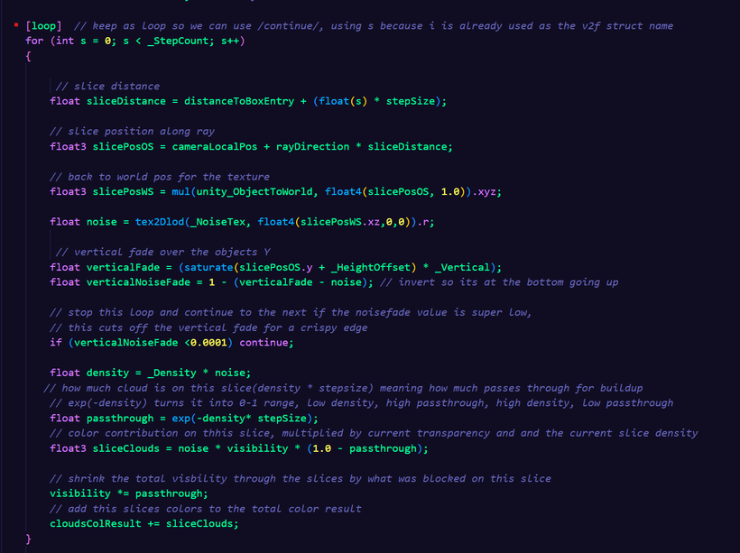

需要注意，要在循环上方加上 `[loop]` 关键字，告诉编译器不要把整个循环展开，而是保留成可以用 `continue` 跳过的循环。

# 噪声的位移与缩放（Moving and Scaling the Noise）

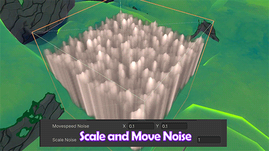

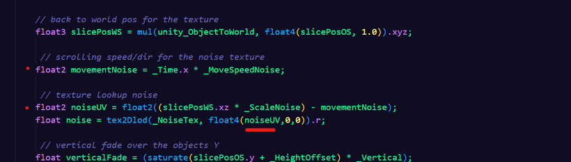

现在缩放有点偏大，我们加上 `_ScaleNoise`，再用 Time 和 `_MoveSpeedNoise`（float2）让噪声动起来。

# 用扭曲做噪声分层（Layering Noise with Distortion）

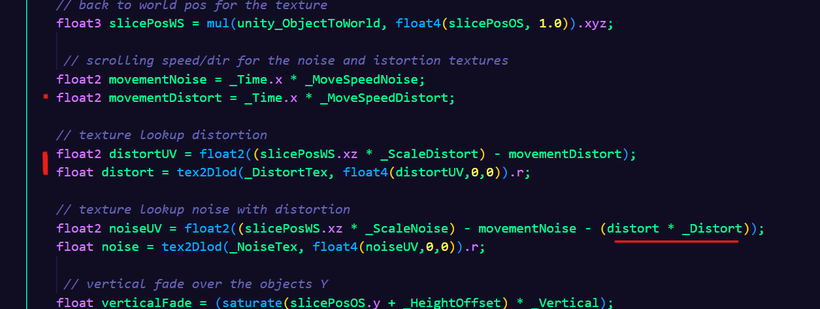

这里我们再采样一张纹理作为 distort（扭曲），并把它从噪声的 UV 中减去。

用 `_Distort` 可以控制有多少扭曲量影响到最终噪声。

# 上色（Colorize）

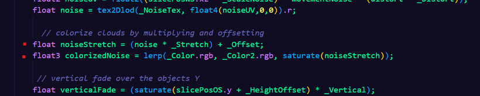

颜色部分，我们取分层后的噪声结果，对数值做拉伸（stretch）和偏移（offset），这样可以控制颜色的分布位置。

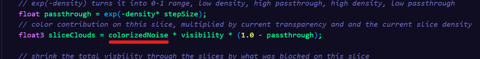

然后在切片颜色累加时，用 ColorizedNoise 替换掉原来的 noise。

# 边缘淡出（Fading Edges）

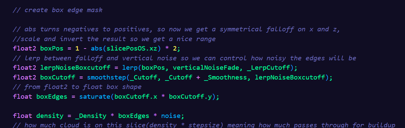

如果云铺满整个可见空间，这一步可以不做；但如果你的云会出现在能看见边界的空间里，就需要一个好看的衰减。

我们用柔和的盒状遮罩（soft box mask）来做边缘淡出。（我在《World Position Effects》那篇里也用过这个遮罩，那里讲得更循序渐进。）

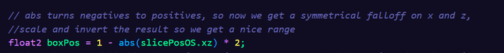

盒子的形状利用 slicePos 的 ObjectSpace 来求——正如你在《Box Volume Fog》里看到的，它的宽度始终是 1 个单位。
所以我们用这个 -0.5 到 0.5 的空间，取绝对值，把两侧都变成 0.5 → 0 → 0.5；
再乘以 2，变回 1 → 0 → 1。

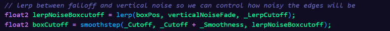

把这个柔和盒状遮罩和前面的垂直渐变用 lerp 混合，用于噪声效果，然后用 step 做出一个截断（cutoff）。

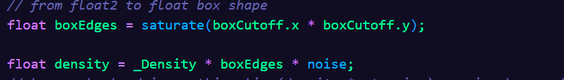

把两侧的结果相乘，得到一个值，再乘进密度里。

# 加抖动（Adding Jitter）

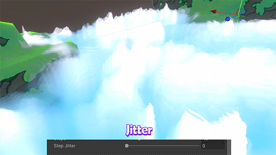

最后还可以加的一件事，是给切片在光线上的位置加一点随机性。

因为这是逐像素加的（每个像素都会投射光线），最终结果会呈现出像抖动（dither）一样的颗粒感。

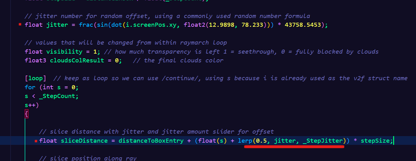

为此我们用这个常见的 0–1 随机公式（我不确定它的出处，但 shader 里用得很多，我是在 Shader Graph 的 random 节点里看到的）。

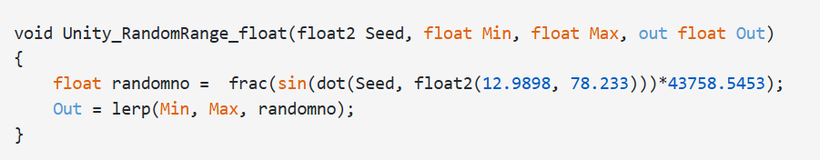

然后把它加到「到盒子进入点的距离」上，用 `_StepJitter` 控制随机量的多少，在「固定的半步偏移」和「完全随机抖动」之间混合，从而随机偏移切片距离。

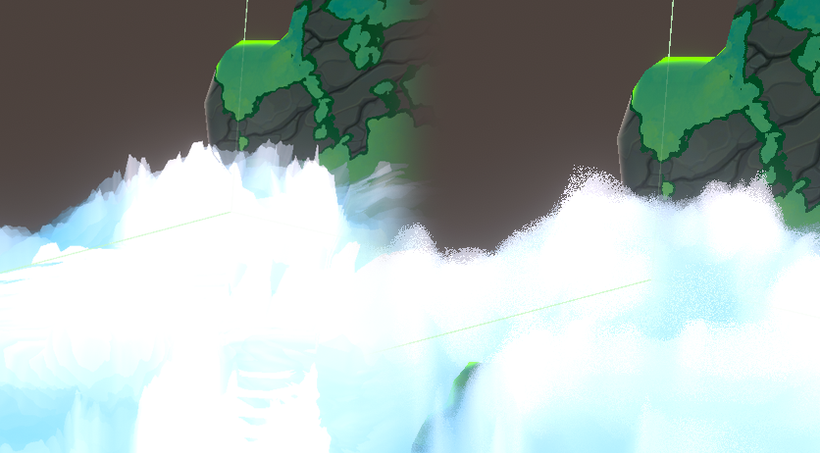

这在 GIF 里可能不太好看出来，所以这里放一张静态对比图。

以上就是全部内容——这就是风格化滚动云的完整做法。

## Shader Graph URP 版本

这里也提供了 Shader Graph URP 版本。

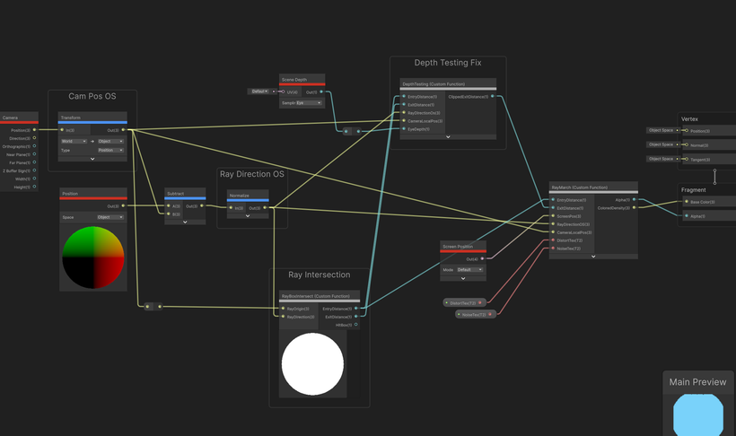

它是以 Volume Fog ShaderGraph 为基础的；同样地，自定义节点用到的 hlsl 文件里就是前面展示过的代码，只是为 Shader Graph 做了调整。

## 文件（Files）

附件包括：

- **RollingCloudsVolume.shader** — BIRP / URP 代码版本（在未来的 URP 版本中可能不再适用）
- Shader Graph 文件 + 用于 Custom Function 的 `.hlsl` 文件
  > [!warning] 注意
  > 你需要手动把 hlsl 文件指定给 Custom Function 节点！

## 备注（Notes）

- 如果想用超过两种颜色，可以把拉伸后的噪声当作 UV 来采样一张 gradient map（渐变贴图），或者在 lerp 里多加一步来引入第三种颜色。
- 如果把 2D 噪声换成 3D 噪声（同时也使用世界坐标），可以得到更随机的垂直云形态。我选择 2D 是因为有趣的 2D 噪声贴图更容易找到，而且低空云在底部是平的／渐收的，并不真的需要多一个维度。不过我也找到了这个 3D 噪声生成器，也许有用：https://noisegen.bubblebirdstudio.com/
- 不同的 Blend Mode 会带来不同结果，可以试试 additive 或 soft additive。

## 参数与贴图（Settings and Textures）

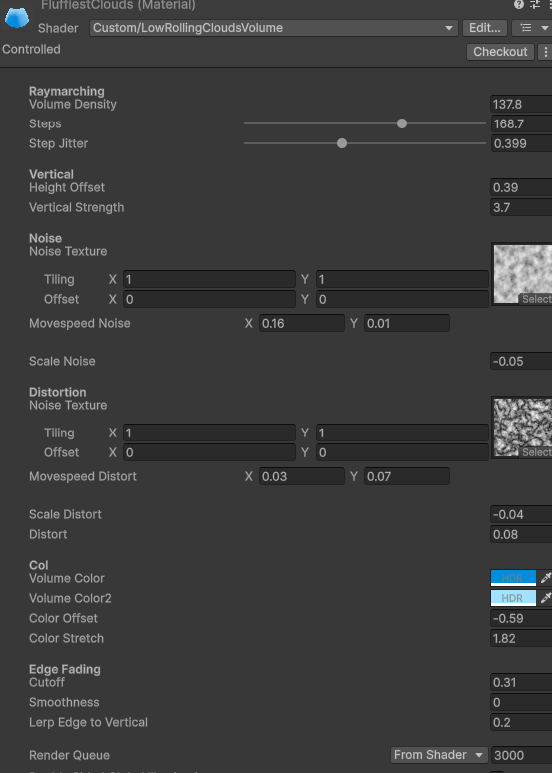

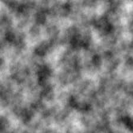

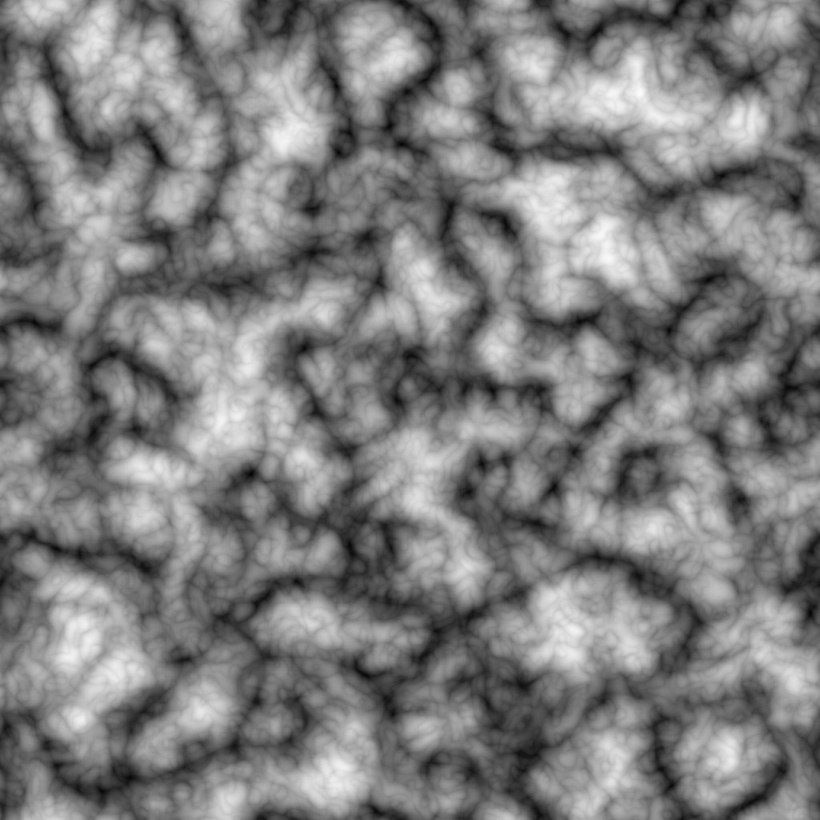

更多噪声可以在这里生成：https://mebiusbox.github.io/contents/EffectTextureMaker/

参考资料：

- Unity 的体积渲染入门
  https://www.youtube.com/watch?v=hXYOlXVRRL8
- Realtime Cloudscapes
  https://blog.maximeheckel.com/posts/real-time-cloudscapes-with-volumetric-raymarching/
- 3D 拼图 GIF 来自：
  https://www.youtube.com/watch?v=_JzfXkRuQzo

感谢阅读！
